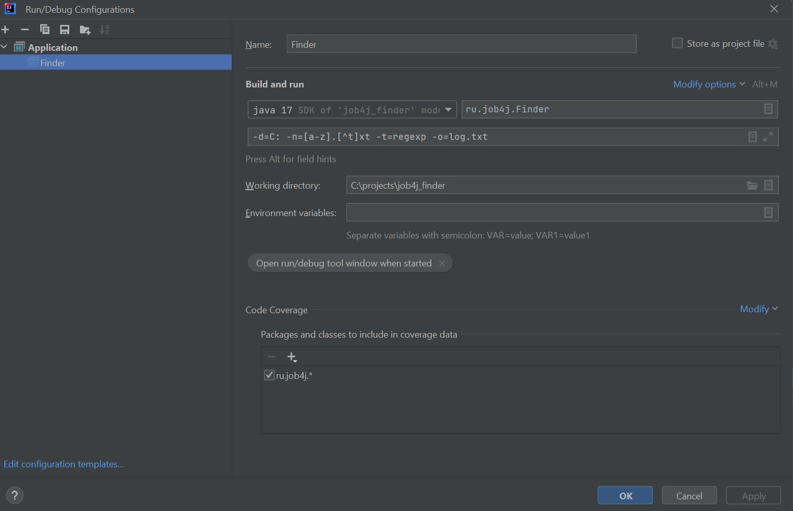
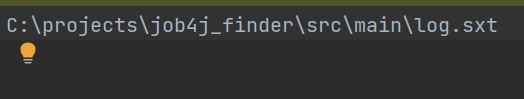

# job4j_finder

### О проекте
Утилита "поиск файлов" - консольная программа для поиска файлов в файловой системе.
- Поиск происходит в заданном каталоге и подкаталоге.
- Имя файла может задаваться: целиком, по маске, по регулярному выражению(не обязательно).
- Программа должна запускаться с параметрами, например:  -d=c:  -n=*.?xt -t=mask -o=log.txt
Ключи
-d - директория, в которой начинать поиск.
-n - имя файла, маска, либо регулярное выражение.
-t - тип поиска: mask искать по маске, name по полному совпадение имени, regex по регулярному выражению.
-o - результат записать в файл.
- Программа записывает результат в файл.
- В программе реализована валидация ключей и подсказка.

### Стек технологий
Java 17, JUnit 5

### Требования к окружению
Java 17, Maven 3.4.0

### Запуск проекта
Сборка:
``` mvn clean install  ```
и далее запускаем:
ru.job4j.Finder -d=C: "-n=[a-z].[^t]xt" -t=regexp -o=log.txt

### Взаимодействие с приложением

#### Скриншоты

##### *Запуск программы из IDE IntelliJ IDEA*



##### *Результат поиска*



### Контакты


- Telegram: [@OlgaIlyina0312](https://t.me/OlgaIlyina0312)
- Email:    [oliljina@mail.ru](oliljina@mail.ru)